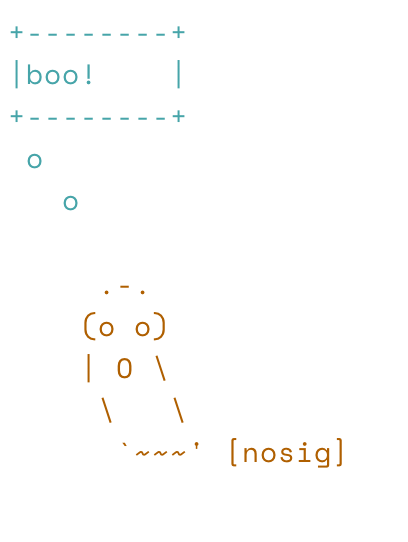
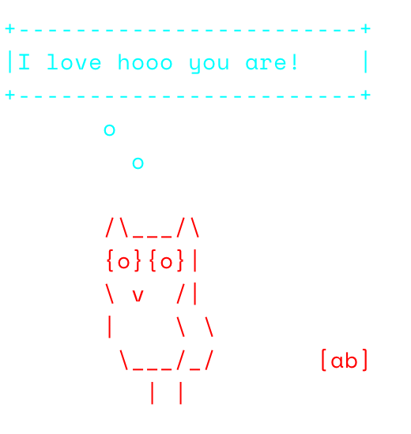
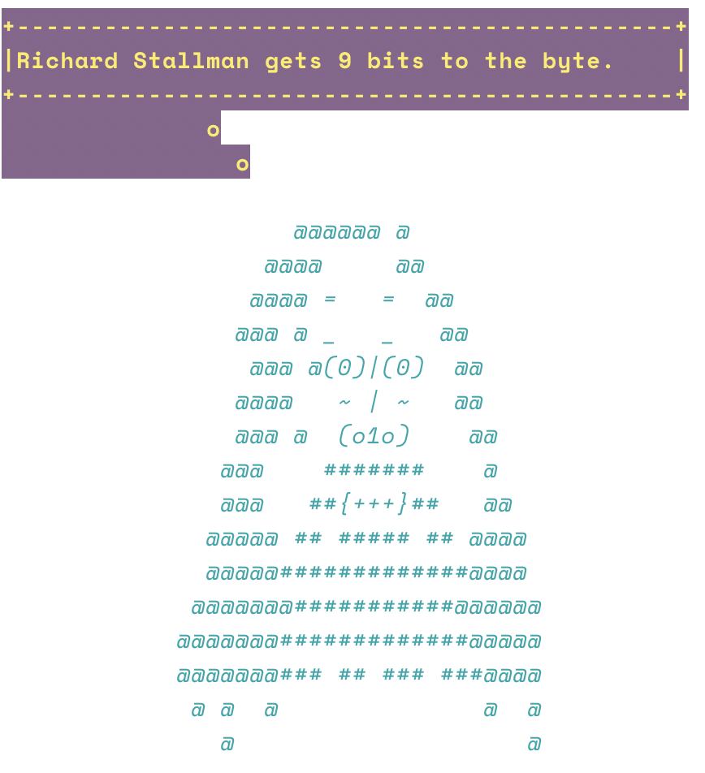
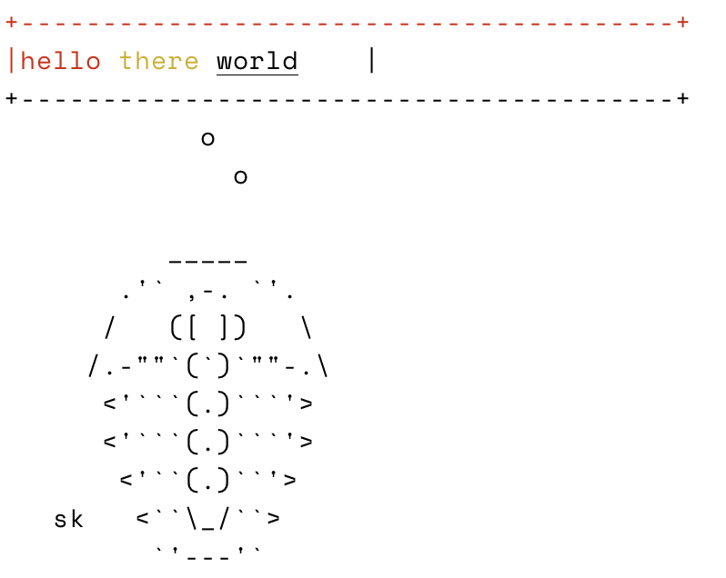

cowsay
======


[](https://github.com/sckott/cowsay/actions?query=workflow%3AR-check)
[](https://codecov.io/gh/sckott/cowsay)
[](https://github.com/r-hub/cranlogs.app)
[](https://cran.r-project.org/package=cowsay)

### What is this?

If you are familiar with `cowsay` on the cli, then you know what this is, but for R.  If not, read below.  Why?  Why not?

### Contributors (alphabetical)


 * Amanda Dobbyn
 * Andreas Brandmaier
 * Andy Teucher
 * Carson Sievert
 * David Schoch
 * Franz-Sebastian Krah
 * Guangchuang Yu
 * Karl Broman
 * Kiyoko Gotanda
 * Lucy D'Agostino McGowan
 * Marion Louveaux
 * Noam Ross
 * Paolo Sonego
 * Philipp Boersch-Supan
 * Rich FitzJohn
 * Scott Chamberlain
 * Thomas Leeper
 * Tyler Rinker

That's right, it takes 18 people to make `cowsay` - it's that hard.

### Contributing

See [CONTRIBUTING.md][contrib]

### Where to find ASCII animal art

Sources to look in:

* https://asciiart.website/ - again, this person only collects them - no mention of license, permissions, etc.

Permissions

In the ascii art mailing list https://groups.google.com/forum/#!forum/alt.ascii-art they say:

```
 As for posting other people's ASCII art,
    after a discussion in news:alt.ascii-art       _     ___
    the following rules were agreed upon:         #_~`--'__ `===-,
    1.  If an ASCII ART picture has initials      `.`.     `#.,//
        on it, leave them on when posting it      ,_\_\     ## #\
    2.  If an ASCII ART picture doesn't have      `__.__    `####\
        initials on it,  mention  that  you            ~~\ ,###'~
        didn't  draw  it  when  posting  it.              \##'
    3.  If somebody  posts a picture without                  [nosig]
        initials and you have an original copy
        with initials on, feel free to re-post the original version.
        *   The re-post ought not to be taken personally, as we all
            know that ASCII art often loses proper credits.
            Responses to the re-post are not necessary.

    One contributor, name of Krogg, suggested the following:

    1.) Ultra polite:...ya make yer own ascii and use it.
    2.)  Very polite:...Ya contact the author and ask if ya
                        can use it...
    3.)       polite:...Ya use it but you keep the Credits
                        in there like they should be.
    4.)         rude:...Ya use it and strip credits.
    5.)    Very rude:...Ya use it and claim that it Is
                        _Your_ very own creation...
```

So, let's go with this rule: Let's include found (on the web) ascii art in this pkg, include signature if there, and if no signature, put in a `[nosig]` (see above).

### Quick watch start

Asciicast: <https://asciinema.org/a/7745>

### Install

From CRAN


``` r
install.packages("cowsay")
```

Dev version


``` r
remotes::install_github("sckott/cowsay")
```


``` r
library("cowsay")
```

### The animals


``` r
sort(names(animals))
#>  [1] "alligator"    "ant"          "anxiouscat"   "bat"          "bat2"        
#>  [6] "behindcat"    "bigcat"       "buffalo"      "cat"          "chicken"     
#> [11] "chuck"        "clippy"       "cow"          "daemon"       "duck"        
#> [16] "duckling"     "egret"        "endlesshorse" "facecat"      "fish"        
#> [21] "frog"         "ghost"        "goldfish"     "grumpycat"    "hypnotoad"   
#> [26] "longcat"      "longtailcat"  "monkey"       "mushroom"     "owl"         
#> [31] "pig"          "poop"         "pumpkin"      "rabbit"       "shark"       
#> [36] "shortcat"     "signbunny"    "smallcat"     "snowman"      "spider"      
#> [41] "squirrel"     "squirrel2"    "stegosaurus"  "stretchycat"  "trilobite"   
#> [46] "turkey"       "whale"        "wolf"         "yoda"
```

### Say Something


``` r
say("time")
#> 
#> +------------------------------+
#> |2024-11-03 07:01:41.670953    |
#> +------------------------------+
#>          o
#>            o
#> 
#>         ^__^ 
#>         (oo)\ ________ 
#>         (__)\         )\ /\ 
#>              ||------w|
#>              ||      ||
```


``` r
say("ain't that some shit", "chicken")
#> 
#> +------------------------+
#> |ain't that some shit    |
#> +------------------------+
#>        o
#>          o
#> 
#>          _
#>        _/ }
#>       `>' \
#>       `|   \
#>        |   /'-.     .-.
#>         \'     ';`--' .'
#>          \'.    `'-./
#>           '.`-..-;`
#>             `;-..'
#>             _| _|
#>             /` /` [nosig]
#> 
```

Add some color: 


``` r
library(crayon)
```


``` r
say("boo!", "ghost",
  what_color = "cyan", by_color = "saddlebrown"
)
```


<p align="left">
  
</p>


``` r
say("I love hooo you are!", "owl",
  what_color = rgb(0, 1, 1), by_color = "#FF0000"
)
```


<p align="left">
  
</p>


String styles together [crayon-style](https://github.com/r-lib/crayon#styles):


``` r
say(
  what = "rms", by = "rms",
  what_color = yellow$bgMagenta$bold,
  by_color = cyan$italic
)
```


<p align="left">
  
</p>


This doesn't preclude you from adding extra crayon colors to your `what` string directly.


``` r
say(
  what = paste0("hello ", crayon::yellow("there "), crayon::underline("world")),
  by = "trilobite"
)
```


<p align="left">
  
</p>

### Vary type of output, default calls message()


``` r
say("hell no!")
#> 
#> +------------+
#> |hell no!    |
#> +------------+
#>    o
#>      o
#> 
#>         ^__^ 
#>         (oo)\ ________ 
#>         (__)\         )\ /\ 
#>              ||------w|
#>              ||      ||
```


``` r
say("hell no!", type = "warning")
#> Warning in say("hell no!", type = "warning"): 
#> +------------+
#> |hell no!    |
#> +------------+
#>    o
#>      o
#> 
#>         ^__^ 
#>         (oo)\ ________ 
#>         (__)\         )\ /\ 
#>              ||------w|
#>              ||      ||
```


``` r
say("hell no!", type = "string")
#> [1] "\n+------------+\n|hell no!    |\n+------------+\n   o\n     o\n\n        ^__^ \n        (oo)\\ ________ \n        (__)\\         )\\ /\\ \n             ||------w|\n             ||      ||"
```


### Catfacts!!!!

From the catfacts API  at <https://catfact.ninja>


``` r
say("catfact", "cat")
#> 
#> +-----------------------------------------------+
#> |The cat's tail is used to maintain balance.    |
#> +-----------------------------------------------+
#>               o
#>                 o
#> 
#>             |\___/|
#>           ==) ^Y^ (==
#>             \  ^  /
#>              )=*=(
#>             /     \
#>             |     |
#>            /| | | |\
#>            \| | |_|/\
#>       jgs  //_// ___/
#>                \_)
#> 
```

### Long cat

From the a Boing Boing tweet on 2014-05-10 "twitter.com/BoingBoing/status/465170473194512384" (post may be gone)


``` r
say("it's caturday", "longcat")
#> Warning in sprintf(animals["longcat"], "%s", body): one argument not used by format '
#>     .ﾊ,,ﾊ
#>     ( ﾟωﾟ)
#>     |つ  つ
#> %s
#>     U "  U
#>         [BoingBoing]
#>     '
#> 
#> +-----------------+
#> |it's caturday    |
#> +-----------------+
#>     o
#>       o
#> 
#>     .ﾊ,,ﾊ
#>     ( ﾟωﾟ)
#>     |つ  つ
#> %s
#>     U "  U
#>         [BoingBoing]
#> 
```

### Grumpy cat


``` r
say("NO!", by = "grumpycat")
#> 
#> +-------+
#> |NO!    |
#> +-------+
#>  o
#>    o
#> 
#>       ﾊ _ ﾊ
#>       ಠ X ಠ
#> 
```


``` r
say("WOKE UP TODAY, IT WAS TERRIBLE", by = "grumpycat")
#> 
#> +----------------------------------+
#> |WOKE UP TODAY, IT WAS TERRIBLE    |
#> +----------------------------------+
#>           o
#>             o
#> 
#>       ﾊ _ ﾊ
#>       ಠ X ಠ
#> 
```


``` r
say("I HAD FUN ONCE, IT WAS AWFUL", by = "grumpycat")
#> 
#> +--------------------------------+
#> |I HAD FUN ONCE, IT WAS AWFUL    |
#> +--------------------------------+
#>          o
#>            o
#> 
#>       ﾊ _ ﾊ
#>       ಠ X ಠ
#> 
```

### Bunny Holding a sign


``` r
say(by = "signbunny")
#> 
#> +----------------+
#> |Hello world!    |
#> +----------------+
#>     o
#>       o
#> 
#> (\__/) ||
#> (•ㅅ•) ||
#> /   づ
#>           [nosig]
#> 
```

### Fish


``` r
say(by = "fish")
#> 
#> +----------------+
#> |Hello world!    |
#> +----------------+
#>     o
#>       o
#> 
#>   ><((((º>  ><((((º>  ><((((º>  ><((((º>  ><((((º>
#>       Kiyoko Gotanda
#> 
```

### R fortunes


``` r
say("fortune", "cat")
#> 
#> +--------------------------------------------------------------+
#> |I thought RStudio was amazing, but RStudio with knitr is      |
#> |approximately `formatC(round(runif(1, 1e8, 1e9)),             |
#> |digits=10, big.mark=',')` times better than RStudio alone!    |
#> |@Geneorama comment on RStudio's new web publishing service    |
#> |RStudio blog June 2012                                        |
#> +--------------------------------------------------------------+
#>                    o
#>                      o
#> 
#>             |\___/|
#>           ==) ^Y^ (==
#>             \  ^  /
#>              )=*=(
#>             /     \
#>             |     |
#>            /| | | |\
#>            \| | |_|/\
#>       jgs  //_// ___/
#>                \_)
#> 
```

You can also pick a particular fortune by number or regex search - if the `fortune` parameter is not `NULL` you don't have pass anything to the `what` parameter (the 1st parameter)


``` r
say(fortune = 100)
#> 
#> +---------------------------------------------------------------+
#> |I'm not sure I'd trust any computer recommendation from        |
#> |1976, no matter how famous the authors are.  Peter Dalgaard    |
#> |after Samuel Edward Kemp cited a recommendation about          |
#> |nonlinear least squares computer programs from                 |
#> |'Box-Jenkins, 1976' R-help January 2005                        |
#> +---------------------------------------------------------------+
#>                     o
#>                       o
#> 
#>         ^__^ 
#>         (oo)\ ________ 
#>         (__)\         )\ /\ 
#>              ||------w|
#>              ||      ||
```


``` r
say(fortune = "whatever")
#> 
#> +---------------------------------------------------------------+
#> |Tom Backer Johnsen: I have just started looking at R, and      |
#> |are getting more and more irritated at myself for not          |
#> |having done that before. However, one of the things I have     |
#> |not found in the documentation is some way of preparing        |
#> |output from R for convenient formatting into something like    |
#> |MS Word. Barry Rowlingson: Well whatever you do, don't         |
#> |start looking at LaTeX, because that will get you even more    |
#> |irritated at yourself for not having done it before.  Tom      |
#> |Backer Johnsen and Barry Rowlingson R-help February 2006       |
#> +---------------------------------------------------------------+
#>                     o
#>                       o
#> 
#>         ^__^ 
#>         (oo)\ ________ 
#>         (__)\         )\ /\ 
#>              ||------w|
#>              ||      ||
```

### Trilobite


``` r
say("Hi there :)", by = "trilobite")
```

````
#> 
#> +---------------+
#> |Hi there :)    |
#> +---------------+
#>     o
#>       o
#> 
#>           _____
#>        .'` ,-. `'.
#>       /   ([ ])   \
#>      /.-""`(`)`""-.\
#>       <'```(.)```'>
#>       <'```(.)```'>
#>        <'``(.)``'>
#>    sk   <``\_/``>
#>          `'---'`
#> 
````

### Shark


``` r
say("Q: What do you call a solitary shark\nA: A lone shark", by = "shark")
#> 
#> +--------------------------------------------------------+
#> |Q: What do you call a solitary shark A: A lone shark    |
#> +--------------------------------------------------------+
#>                  o
#>                    o
#> 
#>               /""-._
#>               .       '-,
#>                :          '',
#>                 ;      *     '.
#>                  ' *         () '.
#>                    \               \
#>                     \      _.---.._ '.
#>                     :  .' _.--''-''  \ ,'
#>         .._           '/.'             . ;
#>         ; `-.          ,                \'
#>          ;   `,         ;              ._\
#>           ;    \     _,-'                ''--._
#>           :    \_,-'                          '-._
#>           \ ,-'                       .          '-._
#>           .'         __.-'';            \...,__       '.
#>         .'      _,-'        \              \   ''--.,__  '\
#>         /    _,--' ;         \              ;           \^.}
#>         ;_,-' )     \  )\      )            ;
#>              /       \/  \_.,-'             ;
#>             /                              ;
#>          ,-'  _,-'''-.    ,-.,            ;      PFA
#>       ,-' _.-'        \  /    |/'-._...--'
#>      :--``             )/
#>   '
#> 
```

### Buffalo


``` r
say("Q: What do you call a single buffalo?\nA: A buffalonely", by = "buffalo")
```

`````
#> 
#> +----------------------------------------------------------+
#> |Q: What do you call a single buffalo? A: A buffalonely    |
#> +----------------------------------------------------------+
#>                   o
#>                     o
#> 
#>                    _.-````'-,_
#>          _,.,_ ,-'`           `'-.,_
#>        /)     (                   '``-.
#>       ((      ) )                      `\
#>         \)    (_/                        )\
#>         |       /)           '    ,'    / \
#>         `\    ^'            '     (    /  ))
#>           |      _/\ ,     /    ,,`\   (  "`
#>           \Y,   |   \  \  | ````| / \_ \
#>             `)_/      \  \  )    ( >  ( >
#>                        \( \(     |/   |/
#>           mic & dwb  /_(/_(    /_(  /_(
#> 
`````

### Clippy


``` r
say(fortune = 59, by = "clippy")
#> 
#> +-------------------------------------------------------------+
#> |Let's not kid ourselves: the most widely used piece of       |
#> |software for statistics is Excel.  Brian D. Ripley           |
#> |'Statistical Methods Need Software: A View of Statistical    |
#> |Computing' Opening lecture RSS 2002, Plymouth September      |
#> |2002                                                         |
#> +-------------------------------------------------------------+
#>                    o
#>                      o
#> 
#> __
#>    / \
#>    | |
#>    @ @
#>   || ||
#>   || ||
#>   |\_/|
#>   \___/ GB
```

### Yoda


``` r
say("fortune", by = "yoda")
```

### Bats!


``` r
say("hi, i'm a bat", by = "bat")
#> 
#> +-----------------+
#> |hi, i'm a bat    |
#> +-----------------+
#>     o
#>       o
#> 
#>         __.--'\     \.__./     /'--.__
#>     _.-'       '.__.'    '.__.'       '-._
#>   .'                                      '.
#>  /                                          \
#> |                                            |
#> |                                            |
#>  \         .---.              .---.         /
#>   '._    .'     '.''.    .''.'     '.    _.'
#>      '-./            \  /           \.-'
#>                       ''mrf
```

See also `bat2`

### Monkey!


``` r
say("fortune", by = "monkey")
#> 
#> +--------------------------------------------------------------+
#> |That's a casual model, not a causal model - you can tell      |
#> |the difference by looking for the word "excel".  Hadley       |
#> |Wickham commenting on an Excel chart showing student's SAT    |
#> |score increases with family income, without considering       |
#> |further covariates http://twitter.com/#!/hadleywickham        |
#> |February 2012                                                 |
#> +--------------------------------------------------------------+
#>                    o
#>                      o
#> 
#> 
#>                   .="=.
#>                 _/.-.-.\_     _
#>                ( ( o o ) )    ))
#>                 |/  "  \|    //
#>                  \'---'/    //
#>            jgs   /`"""`\\  ((
#>                 / /_,_\ \\  \\
#>                 \_\_'__/  \  ))
#>                 /`  /`~\   |//
#>                /   /    \  /
#>           ,--`,--'\/\    /
#>           '-- "--'  '--'
```

### Daemon!


``` r
say("fortune", by = "daemon")
#> 
#> +------------------------------------------------------------+
#> |I want a budget.  Peter Dalgaard in a talk about Tcl/Tk,    |
#> |meaning to say 'I want a button widget' gR 2003, Aalborg    |
#> |September 2003                                              |
#> +------------------------------------------------------------+
#>                    o
#>                      o
#> 
#>             ,        ,
#>            /(        )`
#>            \ \___   / |
#>             /- _  `-/  '
#>            (/\/ \ \   /\
#>            / /   | `    
#>            O O   ) /    |
#>            `-^--'`<     '
#>           (_.)  _  )   /
#>            `.___/`    /
#>              `-----' /
#> <----.     __ / __   \
#> <----|====O)))==) \) /====
#> <----'    `--' `.__,' \
#>              |        |
#>               \       /
#>         ______( (_  / \______
#>       ,'  ,-----'   |        \
#>       `--{__________)        \/ [nosig]
```

### Egret


``` r
say("je ne regrette rien", by = "egret")
#> 
#> +-----------------------+
#> |je ne regrette rien    |
#> +-----------------------+
#>       o
#>         o
#> 
#>        \   _,
#>       -==<' `
#>           ) /
#>          / (_.
#>         |  ,-,`\
#>          \\   \ \
#>           `\,  \ \
#>            ||\  \`|,
#>  jgs      _|| `=`-'
#>          ~~`~`
```


See also `bat2`

### Endless horse


``` r
endless_horse()
## -----
## Hello world!
## ------
##    \
##     \
##      \
##       ,
##    _,,)\.~,,._
##     (()`  ``)\))),,_
##      |     \ ''((\)))),,_          ____
##      |6`   |   ''((\())) "-.____.-"    `-.-,
##      |    .'\    ''))))'                  \)))
##      |   |   `.     ''                     ((((
##      \, _)     \/                          |))))
##       `'        |                          (((((
##                 \                  |       ))))))
##                  `|    |           ,\     /((((((
##                   |   / `-.______.<  \   |  )))))
##                   |   |  /         `. \  \  ((((
##                   |  / \ |           `.\  | (((
##                   \  | | |             )| |  ))
##                    | | | |             || |  '   [endless.horse]
##                    | | | |             || |
##
##                    | | | |             || |
##                    | | | |             || |
##                    | | | |             || |
##                    | | | |             || |
##                    | | | |             || |
##                    | | | |             || |
##                    | | | |             || |
##                    | | | |             || |
##                    | | | |             || |
##                    | | | |             || |
```

### Using pipes


``` r
library("magrittr")
"I HAD FUN ONCE, IT WAS AWFUL" %>% say("grumpycat")
#> 
#> +--------------------------------+
#> |I HAD FUN ONCE, IT WAS AWFUL    |
#> +--------------------------------+
#>          o
#>            o
#> 
#>       ﾊ _ ﾊ
#>       ಠ X ಠ
#> 
```

### I just want the animals!

Okay, hold your endless horses. Just use the exported vector `animals`, and you can select the animal you want by name.


``` r
animals["clippy"]
#>                                                                     clippy 
#> "\n__\n   / \\\n   | |\n   @ @\n  || ||\n  || ||\n  |\\_/|\n  \\___/ GB\n"
```

## Meta

* License: MIT
* Please note that this project is released with a [Contributor Code of Conduct][coc]. By participating in this project you agree to abide by its terms.

[coc]: https://github.com/sckott/cowsay/blob/main/.github/CODE_OF_CONDUCT.md
[contrib]: https://github.com/sckott/cowsay/blob/main/.github/CONTRIBUTING.md
