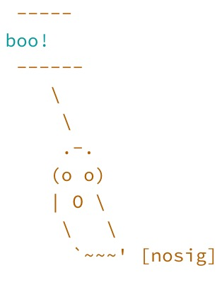
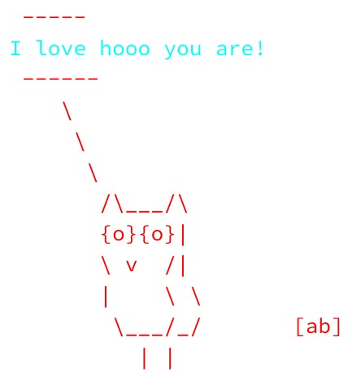
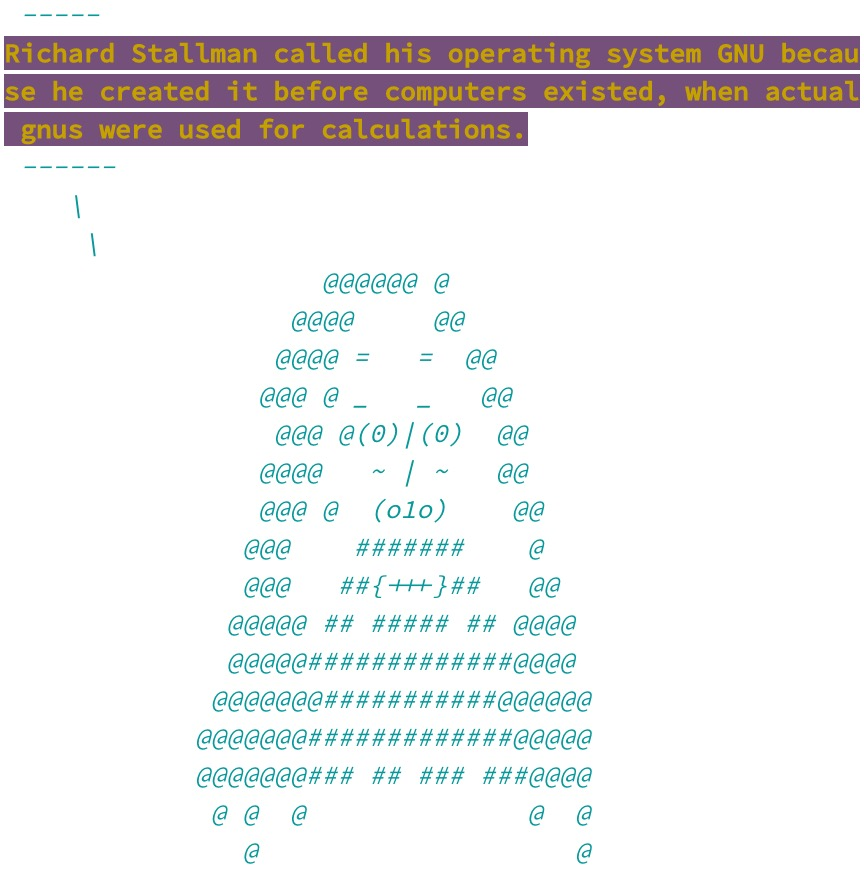
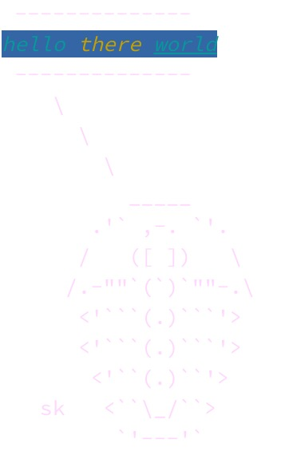

# cowsay


[](https://github.com/sckott/cowsay/actions?query=workflow%3AR-check)
[](https://app.codecov.io/gh/sckott/cowsay)
[](https://github.com/r-hub/cranlogs.app)
[](https://cran.r-project.org/package=cowsay)

### What is this?

If you are familiar with `cowsay` on the cli, then you know what this
is, but for R. If not, read below. Why? Why not?

### Contributors (alphabetical)

-   Amanda Dobbyn
-   Andreas Brandmaier
-   Andy Teucher
-   Carson Sievert
-   Franz-Sebastian Krah
-   Guangchuang Yu
-   Karl Broman
-   Kiyoko Gotanda
-   Lucy D’Agostino McGowan
-   Marion Louveaux
-   Noam Ross
-   Paolo Sonego
-   Philipp Boersch-Supan
-   Rich FitzJohn
-   Scott Chamberlain
-   Thomas Leeper
-   Tyler Rinker

That’s right, it takes 17 people to make `cowsay` - it’s that hard.

### Contributing

See
[CONTRIBUTING.md](https://github.com/sckott/cowsay/blob/main/.github/CONTRIBUTING.md)

### Where to find ASCII animal art

Sources to look in:

-   <https://asciiart.website/> - again, this person only collects
    them - no mention of license, permissions, etc.
-   <https://www.asciiworld.com/>

Permissions

In the ascii art mailing list
<https://groups.google.com/forum/#!forum/alt.ascii-art> they say:

     As for posting other people's ASCII art,
        after a discussion in news:alt.ascii-art       _     ___
        the following rules were agreed upon:         #_~`--'__ `===-,
        1.  If an ASCII ART picture has initials      `.`.     `#.,//
            on it, leave them on when posting it      ,_\_\     ## #\
        2.  If an ASCII ART picture doesn't have      `__.__    `####\
            initials on it,  mention  that  you            ~~\ ,###'~
            didn't  draw  it  when  posting  it.              \##'
        3.  If somebody  posts a picture without                  [nosig]
            initials and you have an original copy
            with initials on, feel free to re-post the original version.
            *   The re-post ought not to be taken personally, as we all
                know that ASCII art often loses proper credits.
                Responses to the re-post are not necessary.

        One contributor, name of Krogg, suggested the following:

        1.) Ultra polite:...ya make yer own ascii and use it.
        2.)  Very polite:...Ya contact the author and ask if ya
                            can use it...
        3.)       polite:...Ya use it but you keep the Credits
                            in there like they should be.
        4.)         rude:...Ya use it and strip credits.
        5.)    Very rude:...Ya use it and claim that it Is
                            _Your_ very own creation...

So, let’s go with this rule: Let’s include found (on the web) ascii art
in this pkg, include signature if there, and if no signature, put in a
`[nosig]` (see above).

### Quick watch start

Asciicast: <https://asciinema.org/a/7745>

### Install

From CRAN

    install.packages("cowsay")

Dev version

    remotes::install_github("sckott/cowsay")

    library("cowsay")

### The animals

    sort(names(animals))
    #>  [1] "alligator"    "ant"          "anxiouscat"   "bat"          "bat2"        
    #>  [6] "behindcat"    "bigcat"       "buffalo"      "cat"          "chicken"     
    #> [11] "chuck"        "clippy"       "cow"          "daemon"       "duck"        
    #> [16] "duckling"     "egret"        "endlesshorse" "facecat"      "fish"        
    #> [21] "frog"         "ghost"        "goldfish"     "grumpycat"    "hypnotoad"   
    #> [26] "longcat"      "longtailcat"  "monkey"       "mushroom"     "owl"         
    #> [31] "pig"          "poop"         "pumpkin"      "rabbit"       "shark"       
    #> [36] "shortcat"     "signbunny"    "smallcat"     "snowman"      "spider"      
    #> [41] "squirrel"     "squirrel2"    "stegosaurus"  "stretchycat"  "trilobite"   
    #> [46] "turkey"       "whale"        "wolf"         "yoda"

### Say Something

    say('time')
    #> 
    #>  -------------- 
    #> 2023-03-06 12:53:45 
    #>  --------------
    #>     \
    #>       \
    #>         \
    #>             |\___/|
    #>           ==) ^Y^ (==
    #>             \  ^  /
    #>              )=*=(
    #>             /     \
    #>             |     |
    #>            /| | | |\
    #>            \| | |_|/\
    #>       jgs  //_// ___/
    #>                \_)
    #> 

    say("ain't that some shit", "chicken")
    #> 
    #>  ----- 
    #> ain't that some shit 
    #>  ------ 
    #>     \   
    #>      \
    #>          _
    #>        _/ }
    #>       `>' \
    #>       `|   \
    #>        |   /'-.     .-.
    #>         \'     ';`--' .'
    #>          \'.    `'-./
    #>           '.`-..-;`
    #>             `;-..'
    #>             _| _|
    #>             /` /` [nosig]
    #> 

Add some color:

    library(multicolor)
    library(crayon)

    say("boo!", "ghost", 
        what_color = "cyan", by_color = "saddlebrown")

<p align="left">

</p>

    say("I love hooo you are!", "owl", 
        what_color = rgb(0, 1, 1), by_color = "#FF0000")

<p align="left">

</p>

String styles together
[crayon-style](https://github.com/r-lib/crayon#styles):

    say(what = "rms", by = "rms", 
            what_color = yellow$bgMagenta$bold,
            by_color = cyan$italic)

<p align="left">

</p>

This doesn’t preclude you from adding extra crayon colors to your `what`
string directly.

    say(what = paste0("hello ", crayon::yellow("there "), crayon::underline("world")), 
        by = "trilobite", 
        what_color = bgBlue$cyan$italic,
        by_color = "thistle")  # Don't ask me why "thistle" is pink/purple

<p align="left">

</p>

Multiple colors are also possible (uses the
[`multicolor`](https://github.com/aedobbyn/multicolor) package):

    say(what = "I'm a rare Irish buffalo",
        by = "buffalo", 
        what_color = c("salmon2", "darkcyan", "salmon2", "darkcyan"),
        by_color = c("green", "white", "orange"))

<p align="left">

</p>

### Vary type of output, default calls message()

    say("hell no!")
    #> 
    #>  -------------- 
    #> hell no! 
    #>  --------------
    #>     \
    #>       \
    #>         \
    #>             |\___/|
    #>           ==) ^Y^ (==
    #>             \  ^  /
    #>              )=*=(
    #>             /     \
    #>             |     |
    #>            /| | | |\
    #>            \| | |_|/\
    #>       jgs  //_// ___/
    #>                \_)
    #> 

    say("hell no!", type="warning")
    #> Warning in say("hell no!", type = "warning"): 
    #>  -------------- 
    #> hell no! 
    #>  --------------
    #>     \
    #>       \
    #>         \
    #>             |\___/|
    #>           ==) ^Y^ (==
    #>             \  ^  /
    #>              )=*=(
    #>             /     \
    #>             |     |
    #>            /| | | |\
    #>            \| | |_|/\
    #>       jgs  //_// ___/
    #>                \_)
    #> 

    say("hell no!", type="string")
    #> [1] "\n -------------- \nhell no! \n --------------\n    \\\n      \\\n        \\\n            |\\___/|\n          ==) ^Y^ (==\n            \\  ^  /\n             )=*=(\n            /     \\\n            |     |\n           /| | | |\\\n           \\| | |_|/\\\n      jgs  //_// ___/\n               \\_)\n  "

### Catfacts!!!!

From the catfacts API at <https://catfact.ninja>

    say("catfact", "cat")
    #> --------------
    #> When a domestic cat goes after mice, about 1 pounce in 3 results in a catch.
    #> --------------
    #>    \
    #>      \
    #>        \
    #>            |\___/|
    #>          ==) ^Y^ (==
    #>            \  ^  /
    #>             )=*=(
    #>            /     \
    #>            |     |
    #>           /| | | |\
    #>           \| | |_|/\
    #>      jgs  //_// ___/
    #>               \_)

### Long cat

From the [a Boing Boing tweet on
2014-05-10](https://twitter.com/BoingBoing/status/465170473194512384)

    say("it's caturday", "longcat")
    #> 
    #>  ----- 
    #> it's caturday 
    #>  ------ 
    #>     \   
    #>      \
    #>     .ﾊ,,ﾊ
    #>     ( ﾟωﾟ)
    #>     |つ  つ
    #>     |    |
    #>     |    |
    #>     |    |
    #>     |    |
    #>     |    |
    #>     |    |
    #>     |    |
    #>     |    |
    #>     |    |
    #>     |    |
    #>     |    |
    #>     |    |
    #>     |    |
    #>     |    |
    #>     |    |
    #>     |    |
    #>     |    |
    #>     |    |
    #>     U "  U
    #>         [BoingBoing]
    #> 

### Grumpy cat

    say('NO!', by='grumpycat')
    #> 
    #>  -------------- 
    #> NO! 
    #>  --------------
    #>     \
    #>       \
    #>         \
    #>       ﾊ _ ﾊ
    #>       ಠ X ಠ
    #> 

    say('WOKE UP TODAY, IT WAS TERRIBLE', by='grumpycat')
    #> 
    #>  -------------- 
    #> WOKE UP TODAY, IT WAS TERRIBLE 
    #>  --------------
    #>     \
    #>       \
    #>         \
    #>       ﾊ _ ﾊ
    #>       ಠ X ಠ
    #> 

    say('I HAD FUN ONCE, IT WAS AWFUL', by='grumpycat')
    #> 
    #>  -------------- 
    #> I HAD FUN ONCE, IT WAS AWFUL 
    #>  --------------
    #>     \
    #>       \
    #>         \
    #>       ﾊ _ ﾊ
    #>       ಠ X ಠ
    #> 

### Bunny Holding a sign

    say(by='signbunny')
    #> 
    #>  -------------- 
    #> Hello world! 
    #>  --------------
    #> (\__/) ||
    #> (•ㅅ•) ||
    #> /   づ
    #>           [nosig]
    #> 

### Fish

    say(by='fish')
    #> 
    #>  ----- 
    #> Hello world! 
    #>  ------ 
    #>     \   
    #>      \
    #>   ><((((º>  ><((((º>  ><((((º>  ><((((º>  ><((((º>
    #>       Kiyoko Gotanda
    #> 

### R fortunes

    say('fortune','cat')
    #> 
    #>  -------------- 
    #> Michael Watson: Hopefully this one isn't in the manual or I am about to get shot :-S
    #> Peter Dalgaard: *Kapow*...
    #>  Michael Watson and Peter Dalgaard
    #>  question on axis()
    #>  R-help
    #>  February 2006 
    #>  --------------
    #>     \
    #>       \
    #>         \
    #>             |\___/|
    #>           ==) ^Y^ (==
    #>             \  ^  /
    #>              )=*=(
    #>             /     \
    #>             |     |
    #>            /| | | |\
    #>            \| | |_|/\
    #>       jgs  //_// ___/
    #>                \_)
    #> 

You can also pick a particular fortune by number or regex search - if
the `fortune` parameter is not `NULL` you don’t have pass anything to
the `what` parameter (the 1st parameter)

    say(fortune=100)
    #> 
    #>  -------------- 
    #> I'm not sure I'd trust any computer recommendation from 1976, no matter how famous the authors are.
    #>  Peter Dalgaard
    #>  after Samuel Edward Kemp cited a recommendation about nonlinear least squares computer programs from 'Box-Jenkins, 1976'
    #>  R-help
    #>  January 2005 
    #>  --------------
    #>     \
    #>       \
    #>         \
    #>             |\___/|
    #>           ==) ^Y^ (==
    #>             \  ^  /
    #>              )=*=(
    #>             /     \
    #>             |     |
    #>            /| | | |\
    #>            \| | |_|/\
    #>       jgs  //_// ___/
    #>                \_)
    #> 

    say(fortune='whatever')
    #> 
    #>  -------------- 
    #> Justin: Is there a function that just does whatever I'm thinking (aka whatever my homework question is...)?
    #> Joshua Ulrich: That's the magic_pony function.
    #>  Justin and Joshua Ulrich
    #>  stackoverflow.com
    #>  June 2013 
    #>  --------------
    #>     \
    #>       \
    #>         \
    #>             |\___/|
    #>           ==) ^Y^ (==
    #>             \  ^  /
    #>              )=*=(
    #>             /     \
    #>             |     |
    #>            /| | | |\
    #>            \| | |_|/\
    #>       jgs  //_// ___/
    #>                \_)
    #> 

### Trilobite

    say("Hi there :)", by='trilobite')
    #> 
    #>  -------------- 
    #> Hi there :) 
    #>  --------------
    #>     \
    #>       \
    #>         \
    #>           _____
    #>        .'` ,-. `'.
    #>       /   ([ ])   \
    #>      /.-""`(`)`""-.\
    #>       <'```(.)```'>
    #>       <'```(.)```'>
    #>        <'``(.)``'>
    #>    sk   <``\_/``>
    #>          `'---'`
    #> 

### Shark

    say('Q: What do you call a solitary shark\nA: A lone shark', by='shark')
    #> 
    #>  -------------- 
    #> Q: What do you call a solitary shark
    #> A: A lone shark 
    #>  --------------
    #>     \
    #>       \
    #>         \
    #>               /""-._
    #>               .       '-,
    #>                :          '',
    #>                 ;      *     '.
    #>                  ' *         () '.
    #>                    \               \
    #>                     \      _.---.._ '.
    #>                     :  .' _.--''-''  \ ,'
    #>         .._           '/.'             . ;
    #>         ; `-.          ,                \'
    #>          ;   `,         ;              ._\
    #>           ;    \     _,-'                ''--._
    #>           :    \_,-'                          '-._
    #>           \ ,-'                       .          '-._
    #>           .'         __.-'';            \...,__       '.
    #>         .'      _,-'        \              \   ''--.,__  '\
    #>         /    _,--' ;         \              ;           \^.}
    #>         ;_,-' )     \  )\      )            ;
    #>              /       \/  \_.,-'             ;
    #>             /                              ;
    #>          ,-'  _,-'''-.    ,-.,            ;      PFA
    #>       ,-' _.-'        \  /    |/'-._...--'
    #>      :--``             )/
    #>   '
    #> 

### Buffalo

    say('Q: What do you call a single buffalo?\nA: A buffalonely', by='buffalo')
    #> 
    #>  -------------- 
    #> Q: What do you call a single buffalo?
    #> A: A buffalonely 
    #>  --------------
    #>     \
    #>       \
    #>         \
    #>                    _.-````'-,_
    #>          _,.,_ ,-'`           `'-.,_
    #>        /)     (                   '``-.
    #>       ((      ) )                      `\
    #>         \)    (_/                        )\
    #>         |       /)           '    ,'    / \
    #>         `\    ^'            '     (    /  ))
    #>           |      _/\ ,     /    ,,`\   (  "`
    #>           \Y,   |   \  \  | ````| / \_ \
    #>             `)_/      \  \  )    ( >  ( >
    #>                        \( \(     |/   |/
    #>           mic & dwb  /_(/_(    /_(  /_(
    #> 

### Clippy

    say(fortune=59, by="clippy")
    #> 
    #> 
    #>  ----- 
    #> Let's not kid ourselves: the most widely used piece of software for statistics is Excel.
    #>  Brian D. Ripley
    #>  'Statistical Methods Need Software: A View of Statistical Computing'
    #>  Opening lecture RSS 2002, Plymouth
    #>  September 2002 
    #>  ------ 
    #>     \   
    #>      \   __
    #>    / \
    #>    | |
    #>    @ @
    #>   || ||
    #>   || ||
    #>   |\_/|
    #>   \___/ GB

### Yoda

    say("fortune", by = "yoda")

### Bats!

    say("hi, i'm a bat", by="bat")
    #> 
    #>  ------------- 
    #> hi, i'm a bat 
    #>  -------------- 
    #>               \   
    #>                \  
    #>                 \
    #>         __.--'\     \.__./     /'--.__
    #>     _.-'       '.__.'    '.__.'       '-._
    #>   .'                                      '.
    #>  /                                          \
    #> |                                            |
    #> |                                            |
    #>  \         .---.              .---.         /
    #>   '._    .'     '.''.    .''.'     '.    _.'
    #>      '-./            \  /           \.-'
    #>                       ''mrf

See also `bat2`

### Monkey!

    say("fortune", by = "monkey")
    #> 
    #>  ------------- 
    #> Getting flamed for asking dumb questions on a public mailing list is all part of growing up and being a man/woman.
    #>  Michael Watson
    #>  in a discussion on whether answers on R-help should be more polite
    #>  R-help
    #>  December 2004 
    #>  -------------- 
    #>               \   
    #>                \  
    #>                 \
    #> 
    #>                   .="=.
    #>                 _/.-.-.\_     _
    #>                ( ( o o ) )    ))
    #>                 |/  "  \|    //
    #>                  \'---'/    //
    #>            jgs   /`"""`\\  ((
    #>                 / /_,_\ \\  \\
    #>                 \_\_'__/  \  ))
    #>                 /`  /`~\   |//
    #>                /   /    \  /
    #>           ,--`,--'\/\    /
    #>           '-- "--'  '--'

### Daemon!

    say("fortune", by = "daemon")
    #> 
    #>  ----- 
    #> I quit using SAS in 1991 because my productivity jumped at least 20% within one month of using S-Plus.
    #>  Frank Harrell
    #>  R-help
    #>  November 2003 
    #>  ------ 
    #>     \   
    #>      \  
    #>       \
    #>             ,        ,
    #>            /(        )`
    #>            \ \___   / |
    #>             /- _  `-/  '
    #>            (/\/ \ \   /\
    #>            / /   | `    
    #>            O O   ) /    |
    #>            `-^--'`<     '
    #>           (_.)  _  )   /
    #>            `.___/`    /
    #>              `-----' /
    #> <----.     __ / __   \
    #> <----|====O)))==) \) /====
    #> <----'    `--' `.__,' \
    #>              |        |
    #>               \       /
    #>         ______( (_  / \______
    #>       ,'  ,-----'   |        \
    #>       `--{__________)        \/ [nosig]

### Egret

    say("je ne regrette rien", by = "egret")
    #> 
    #>  ----- 
    #> je ne regrette rien 
    #>  ------ 
    #>     \   
    #>      \  
    #>       \
    #>        \   _,
    #>       -==<' `
    #>           ) /
    #>          / (_.
    #>         |  ,-,`\
    #>          \\   \ \
    #>           `\,  \ \
    #>            ||\  \`|,
    #>  jgs      _|| `=`-'
    #>          ~~`~`

See also `bat2`

### Endless horse

    endless_horse()
    ## -----
    ## Hello world!
    ## ------
    ##    \
    ##     \
    ##      \
    ##       ,
    ##    _,,)\.~,,._
    ##     (()`  ``)\))),,_
    ##      |     \ ''((\)))),,_          ____
    ##      |6`   |   ''((\())) "-.____.-"    `-.-,
    ##      |    .'\    ''))))'                  \)))
    ##      |   |   `.     ''                     ((((
    ##      \, _)     \/                          |))))
    ##       `'        |                          (((((
    ##                 \                  |       ))))))
    ##                  `|    |           ,\     /((((((
    ##                   |   / `-.______.<  \   |  )))))
    ##                   |   |  /         `. \  \  ((((
    ##                   |  / \ |           `.\  | (((
    ##                   \  | | |             )| |  ))
    ##                    | | | |             || |  '   [endless.horse]
    ##                    | | | |             || |
    ##
    ##                    | | | |             || |
    ##                    | | | |             || |
    ##                    | | | |             || |
    ##                    | | | |             || |
    ##                    | | | |             || |
    ##                    | | | |             || |
    ##                    | | | |             || |
    ##                    | | | |             || |
    ##                    | | | |             || |
    ##                    | | | |             || |

### Using pipes

    library("magrittr")
    "I HAD FUN ONCE, IT WAS AWFUL" %>% say('grumpycat')
    #> 
    #>  -------------- 
    #> I HAD FUN ONCE, IT WAS AWFUL 
    #>  --------------
    #>     \
    #>       \
    #>         \
    #>       ﾊ _ ﾊ
    #>       ಠ X ಠ
    #> 

### I just want the animals!

Okay, hold your endless horses. Just use the exported vector `animals`,
and you can select the animal you want by name.

    animals['clippy']
    #>                                                                                                                    clippy 
    #> "\n\n ----- \n%s \n ------ \n    \\   \n     \\   __\n   / \\\n   | |\n   @ @\n  || ||\n  || ||\n  |\\_/|\n  \\___/ GB\n"

## Meta

-   License: MIT
-   Please note that this project is released with a [Contributor Code
    of
    Conduct](https://github.com/sckott/cowsay/blob/main/CODE_OF_CONDUCT.md).
    By participating in this project you agree to abide by its terms.
